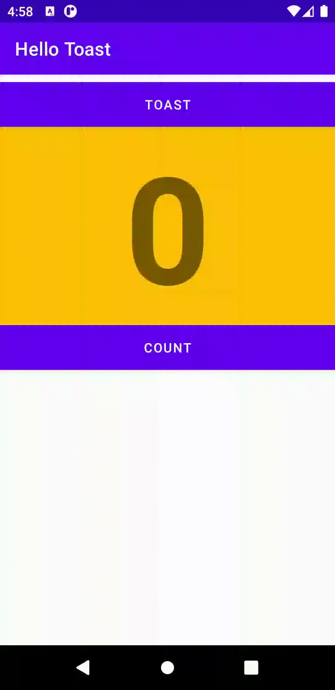
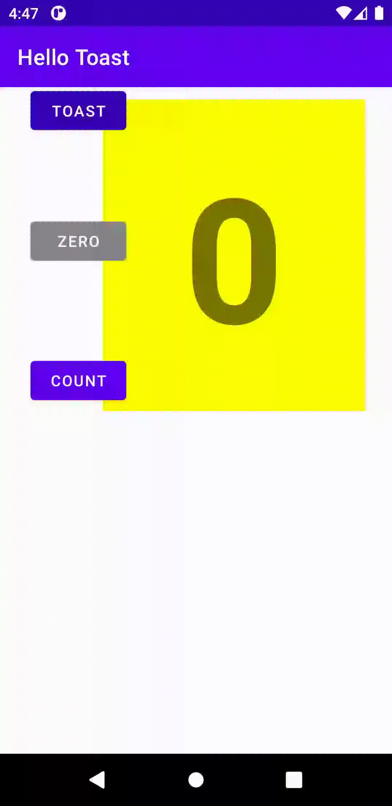
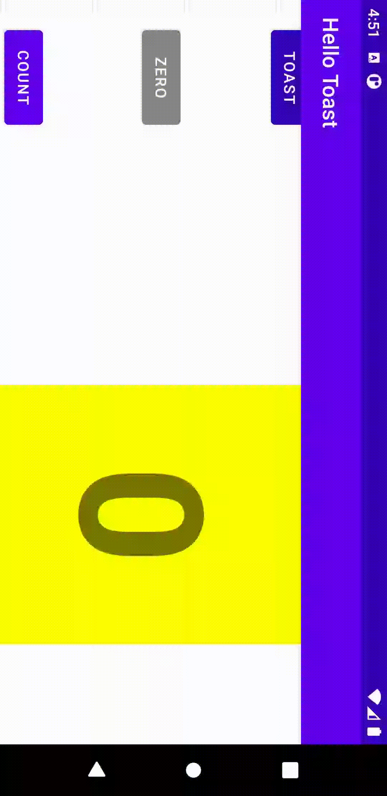
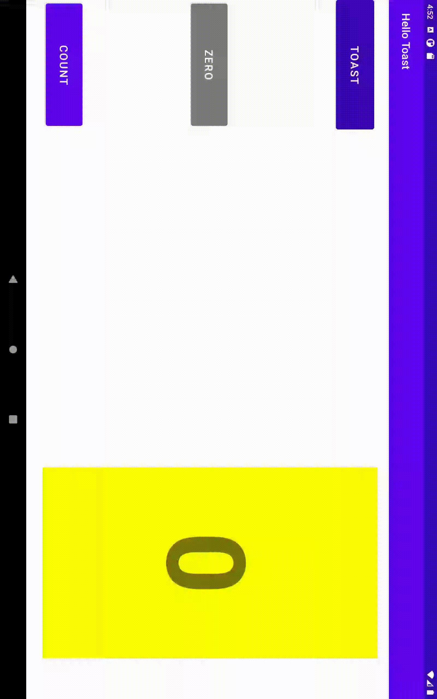
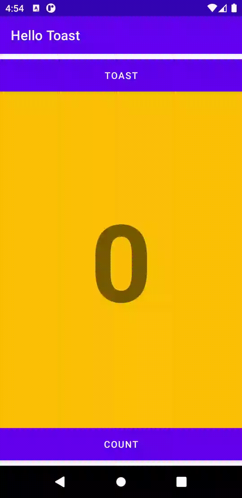
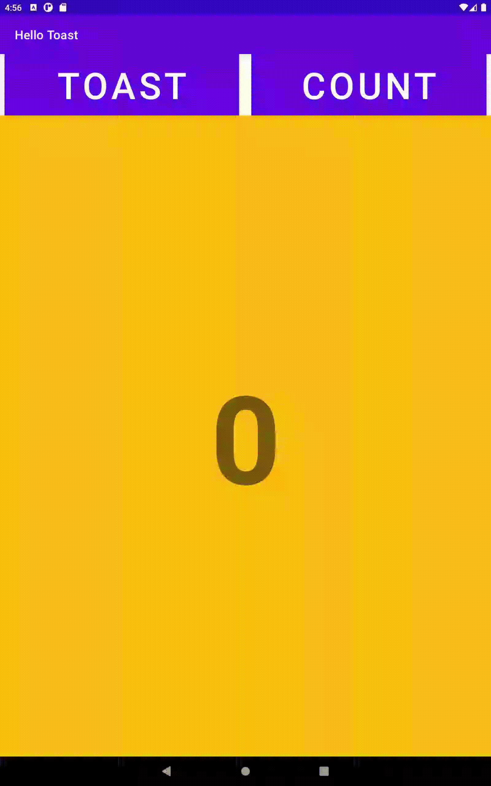
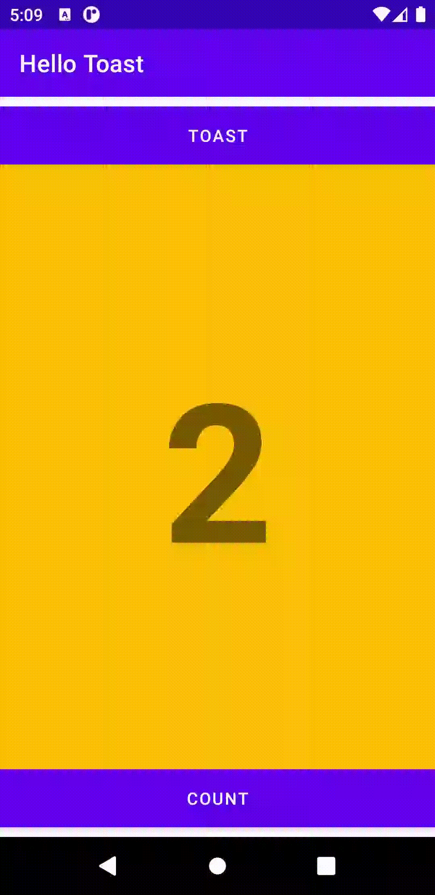
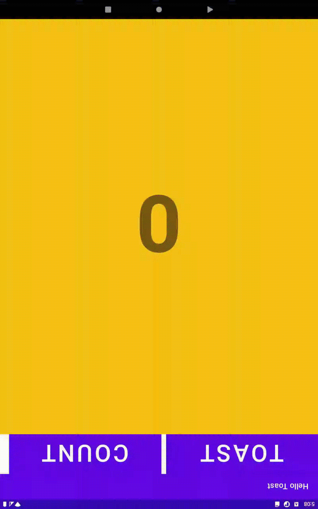

# lab-exercise-2

# RELATIVE LAYOUT/LANDSCAPE

# RELATIVE LAYOUT/TAB

# HELLO CONSTRAINT

# HELLO CONSTRAINT/LANDSCAPE

# HELLO CONSTRAINT/TABLET

# LAYOUT CHALLENGE

# LAYOUT CHALLENGE/TAB

# HELLO TOAST LAYOUT/TAB

# HELLO TOAST/LANDSCAPE

# LINEAR LAYOUT

# LINEAR LAYOUT/TAB

